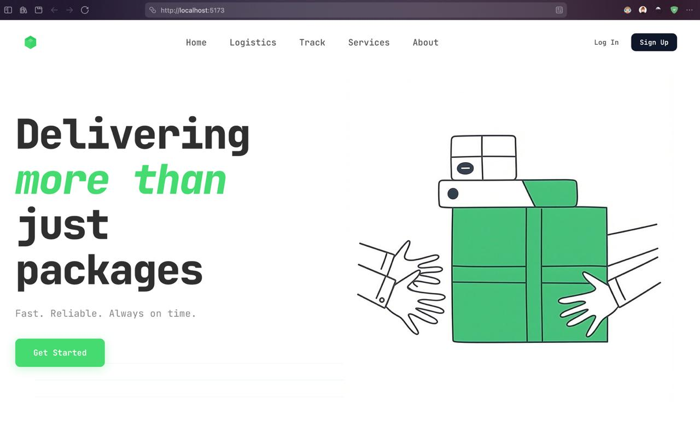
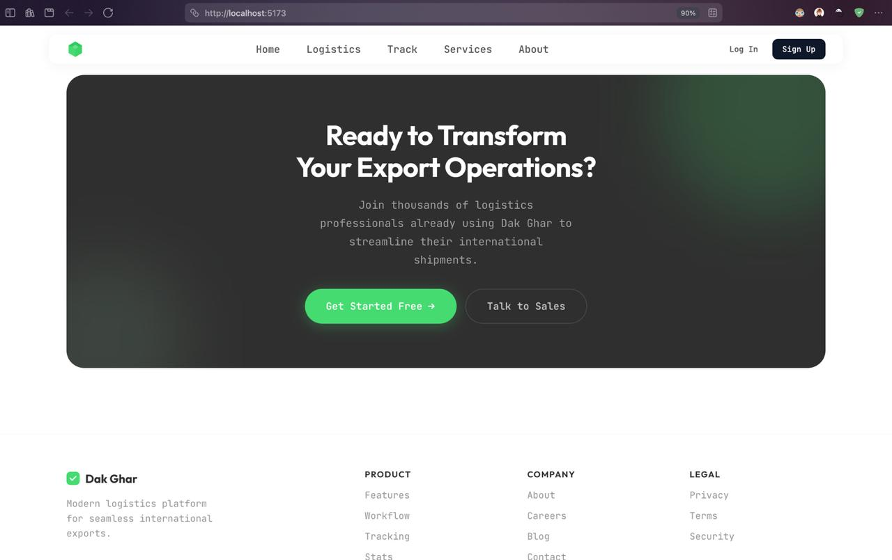
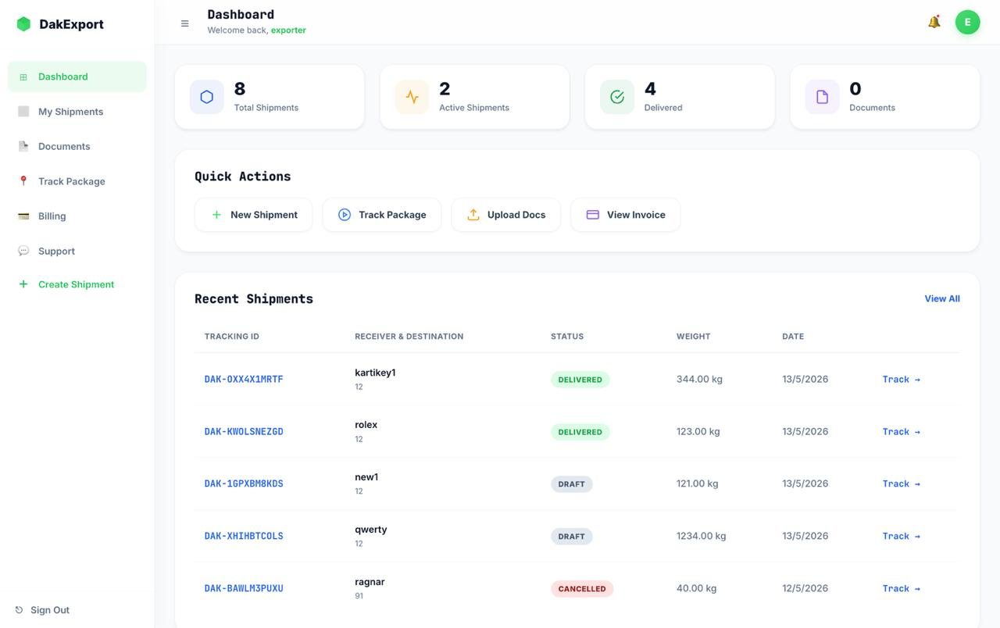
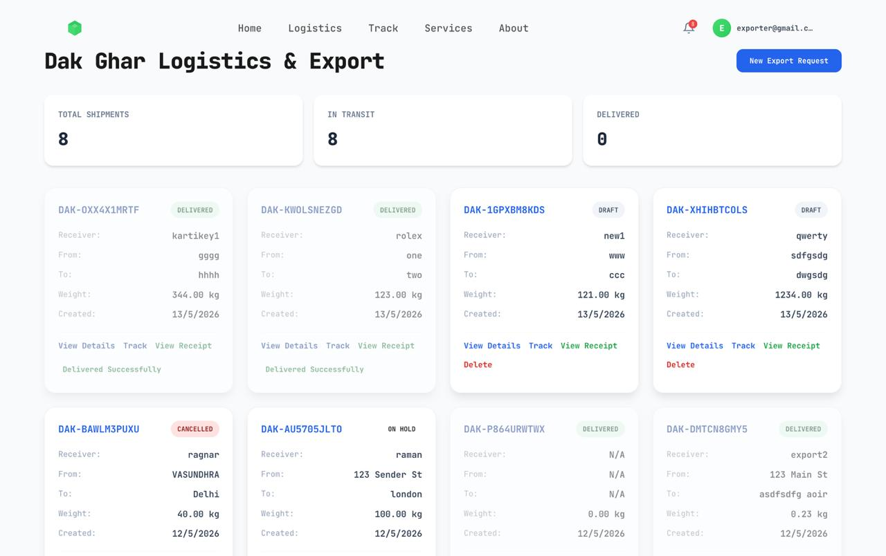
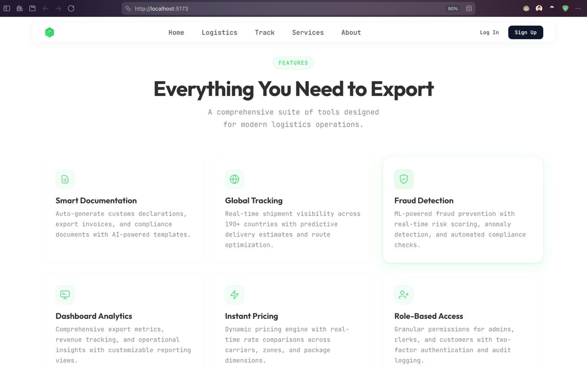
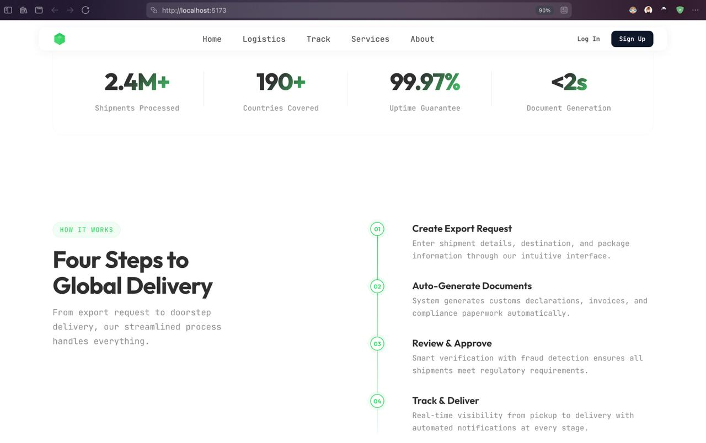
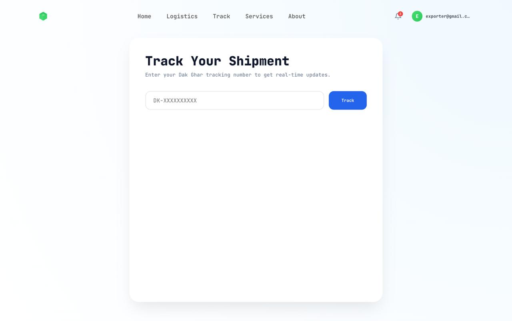
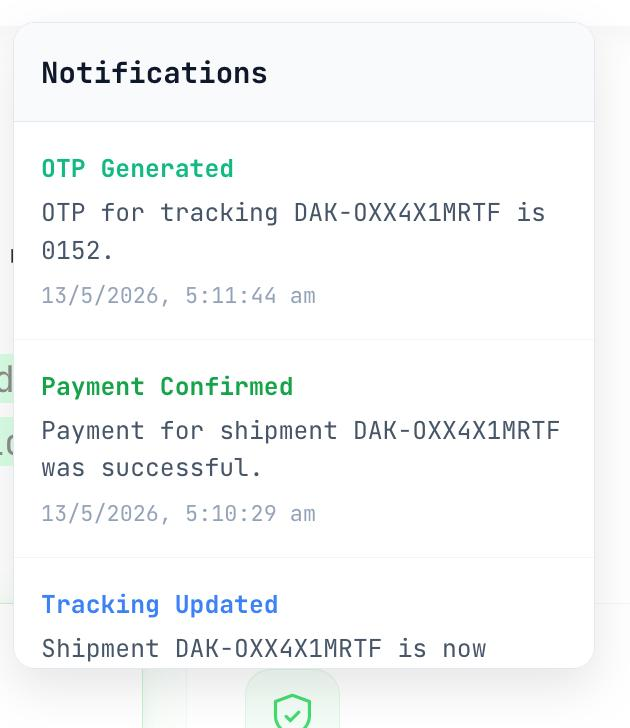
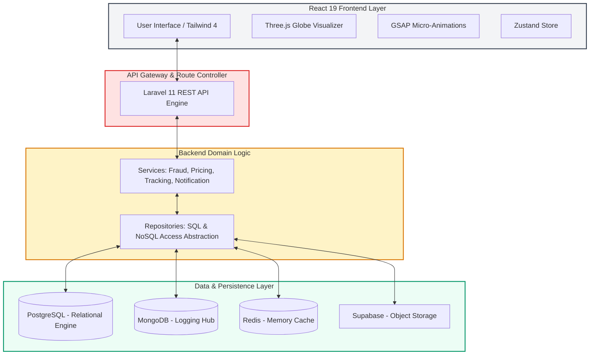
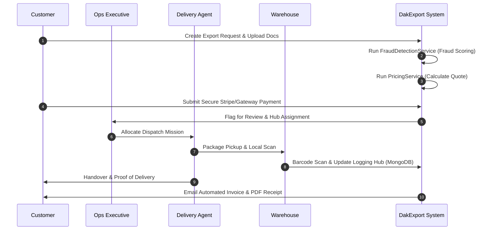

# 📦 DakExport — Premium Logistics & Export Management System

[](https://github.com/KARTIKEYARAWAT/DakExport-Platform/actions/workflows/backend-ci.yml)
[](https://laravel.com)
[](https://reactjs.org)
[](https://threejs.org)
[](https://tailwindcss.com)
[](LICENSE)

**DakExport** is a premium, state-of-the-art full-stack logistics platform designed to manage the entire global export lifecycle. Powered by a high-performance **Laravel 11** backend engine and an ultra-responsive **React 19** frontend, it delivers visual excellence and robust data integrity. From real-time shipment tracking on a **3D Three.js Globe** to dynamic role-based dashboards and automatic fraud detection, DakExport represents the next generation of supply chain orchestration.

---

## 🧭 Interactive Table of Contents

<details open>
  <summary>📱 <b>Quick Navigation (Click to collapse/expand)</b></summary>
  <ul>
    <li><a href="#-key-features">✨ Key Features</a></li>
    <li><a href="#-system-walkthrough--visual-gallery">📸 System Walkthrough & Visual Gallery</a></li>
    <li><a href="#-tech-stack">🛠 Tech Stack</a></li>
    <li><a href="#-system-architecture">🏗 System Architecture</a></li>
    <li><a href="#-core-workflow-export-lifecycle">🔄 Core Workflow: Export Lifecycle</a></li>
    <li><a href="#-getting-started">🚀 Getting Started</a></li>
    <li><a href="#-project-structure">📂 Project Structure</a></li>
    <li><a href="#-role-based-access-control-rbac">🔐 Role-Based Access Control (RBAC)</a></li>
    <li><a href="#-maintenance--helper-cli">🛠 Maintenance & Helper CLI</a></li>
  </ul>
</details>

---

## ✨ Key Features

*   🌍 **3D Shipment Tracking**: Interactive global tracking using custom Three.js vectors and paths to map the shipment journey.
*   🛡️ **Smart Fraud Prevention**: Automatic risk assessment powered by a specialized backend `FraudDetectionService` checking compliance and parcel profiles.
*   💰 **Dynamic Zone Pricing**: Automated weight-and-zone tariffs powered by a high-fidelity `PricingService`.
*   🚀 **Enterprise Architecture**: Solid decoupled backend applying the **Repository & Service Patterns** for enterprise-grade scalability.
*   🔔 **Real-Time Feeds**: Continuous status feeds, dispatch notifications, and transactional email updates.
*   🔐 **Granular Role-Based Access Control**: Tailored portals for Administrators, Customers, Agents, Operations, and Warehouse Managers.

---

## 📸 System Walkthrough & Visual Gallery

To keep the documentation lightweight yet incredibly interactive, click on the dropdown panels below to tour the premium interface designs and workflow stages.

### 🌟 Hero Showcase: Public Portal & Onboarding
The public landing page introduces global logistics solutions with micro-interactions and guides users through a highly secure entry portal.

<details open>
  <summary><b>👁️ Click to view Portal & Onboarding Showcase</b></summary>
  <br>
  <p align="center">
    
    
  </p>
  <p align="center">
    <i>Left: Elegant Modern Landing Page | Right: Dynamic Secure Authentication & Role Selection</i>
  </p>
</details>

---

### 📊 Operations Center: Dashboards & Logistics
The operational backbone of the system. Visualizes active supply routes, system-wide summaries, fleet allocation, and transit analytics.

<details>
  <summary><b>👁️ Click to view Dashboards & Logistics Showcase</b></summary>
  <br>
  <p align="center">
    
    
  </p>
  <p align="center">
    <i>Left: Interactive Central Dashboard Analytics | Right: Global Logistics & Dispatch Manager</i>
  </p>
</details>

---

### 📦 Export Lifecycle & Step-by-Step Delivery Setup
A smooth wizard-based creation flow enabling customers to register cargo, attach tariff codes, and configure custom checkpoints.

<details>
  <summary><b>👁️ Click to view Export Manager & Shipment Builder</b></summary>
  <br>
  <p align="center">
    
    
  </p>
  <p align="center">
    <i>Left: Export Ledger & Document Manager | Right: Multi-Step Shipment Booking Wizard</i>
  </p>
</details>

---

### 🌍 Real-Time Tracking Engine & Notification Feeds
Features a state-of-the-art interactive map and a real-time event pipeline showing live status changes and instant notification triggers.

<details>
  <summary><b>👁️ Click to view Shipment Tracking & Live Notifications</b></summary>
  <br>
  <p align="center">
    
    
  </p>
  <p align="center">
    <i>Left: High-fidelity Live Tracking Map | Right: Dedicated Alerts & Notifications Feed</i>
  </p>
</details>

---

## 🛠 Tech Stack

### Backend (Laravel Engine)
- **Core Platform**: Laravel 11 (PHP 8.2+)
- **Data Persistence**:
  - **Relational SQL**: PostgreSQL (Production) / SQLite (Local Dev)
  - **NoSQL Logging**: MongoDB Atlas (Aggregates high-throughput shipment logs)
- **Caching & Brokers**: Redis (High-speed session management & job queuing)
- **Object Storage**: S3-compatible cloud storage via Supabase
- **Security Protocols**: Laravel Sanctum (SPA Authentication) + Two-Factor Authentication (2FA)

### Frontend (React Ecosystem)
- **Runtime Engine**: React 19 + Vite 8
- **3D Graphics & Canvas**: Three.js (React Three Fiber / `@react-three/drei`) for the tracking globe
- **Micro-interactions**: GSAP (GreenSock Animation Platform) for high-end cinematic transitions
- **Responsive Layout**: Tailwind CSS 4 (Next-gen CSS performance)
- **State Orchestration**: Zustand (Clean, reactive global state)

---

## 🏗 System Architecture

DakExport uses a clean architecture with clear separations of concern. The backend incorporates a robust **Repository Pattern** to abstract PostgreSQL and MongoDB data layers from the business logic, and a **Service Layer** to isolate domain logic.



### Key Core Services
-   `FraudDetectionService`: Executes validation rules, flags high-risk locations, and assigns fraud scores.
-   `PricingService`: Analyzes weight limits, shipping priority, and destination zones to compute live rates.
-   `TrackingService`: Updates real-time shipment status transitions and constructs geospatial route timelines.
-   `StorageService`: Seamlessly manages secure shipping documents, customs files, and receipts.

---

## 🔄 Core Workflow: Export Lifecycle



---

## 🚀 Getting Started

### Prerequisites
-   **PHP 8.2+** & **Composer**
-   **Node.js 20+** & **NPM**
-   **PostgreSQL** (Or local SQLite fallback)

### Installation Guide

#### 1. Clone the Project
```bash
git clone https://github.com/KARTIKEYARAWAT/DakExport-Platform.git
cd DakExport-Platform
```

#### 2. Backend Bootstrapping
```bash
cd backend
composer install
cp .env.example .env
php artisan key:generate
php artisan migrate --seed
php artisan serve
```

#### 3. Frontend Bootstrapping
```bash
cd ../frontend
npm install
npm run dev
```
Open your browser at `http://localhost:5173` to experience the logistics panel.

---

## 📂 Project Structure

```text
DakExport/
├── backend/                  # Laravel 11 REST API Subsystem
│   ├── app/
│   │   ├── Http/             # Controllers, FormRequests, Middleware
│   │   ├── Models/           # Eloquent Data Models
│   │   ├── Repositories/     # Database abstraction pattern
│   │   └── Services/         # Fraud, Pricing, and Tracking engines
│   ├── database/             # Database migrations & database seeders
│   └── routes/               # API routes (versioned under /api/v1/)
├── frontend/                 # React 19 + Vite Subsystem
│   ├── src/
│   │   ├── components/       # Modular UI components (Customer, Admin, Ops)
│   │   ├── pages/            # View managers (Landing page, tracking hub)
│   │   ├── lib/              # Client libraries, API wrappers, utility helpers
│   │   └── store/            # Zustand global stores
├── docs/                     # Technical and database specifications
└── docker-compose.yml        # Multi-container orchestrator configuration
```

---

## 🔐 Role-Based Access Control (RBAC)

DakExport supports detailed RBAC capabilities out of the box, with distinct specialized interfaces:

| User Role | Primary Target Actions | Primary Dashboard | Key Features Accessible |
| :--- | :--- | :--- | :--- |
| **Admin** | System Management, User Roles & Audit Trails | Administrative Panel | Full access, user setup, MongoDB audit log stream |
| **Ops Executive** | Allocation, Carrier Validation, Fraud Approval | Operations Panel | Price adjustments, warehouse routing, fraud reviews |
| **Warehouse Manager** | Cargo Scanning, Status Updates, Storage Auditing | Hub Terminal | Barcode tracking updates, inventory counts |
| **Delivery Agent** | Dispatch Checklists, Navigation, Handover confirmation | Agent Dashboard | Local maps, delivery status log, shift scheduler |
| **Customer** | Ordering, Cost calculator, Shipment tracking | Client Portal | 3D visual tracker, invoice downloads, receipt logs |

---

## 🛠 Maintenance & Helper CLI

Use these commands during testing and local development to keep your platform running cleanly:

### Backend Commands
| Artisan Command | Purpose |
| :--- | :--- |
| `php artisan list` | View complete set of custom platform commands |
| `php artisan route:list` | Print clean ledger of registered API routes |
| `php artisan migrate:fresh --seed` | Wipe Database schema and seed sample data models |
| `php artisan tinker` | Launch interactive PHP environment |

### Frontend Commands
| NPM Command | Purpose |
| :--- | :--- |
| `npm run dev` | Launch high-speed local Vite dev server |
| `npm run build` | Compile optimized production build in `/dist` |
| `npm run lint` | Run ESLint check for style guide adherence |

---

## 📄 License

This project is licensed under the MIT License - see the [LICENSE](LICENSE) file for details.
